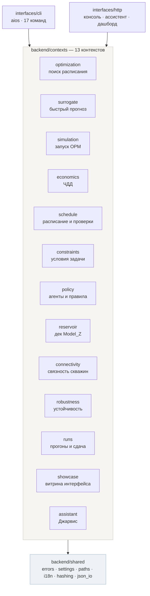
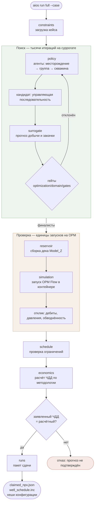
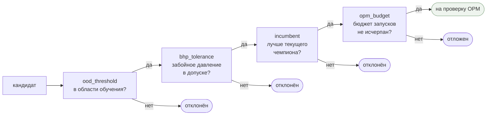
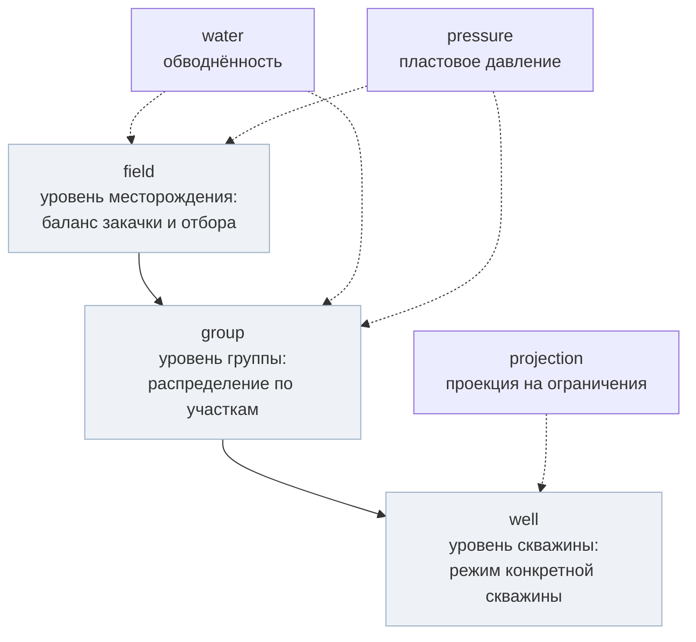
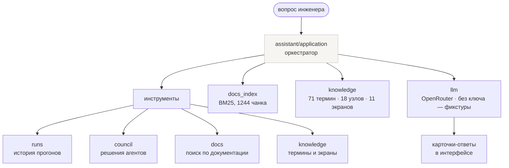
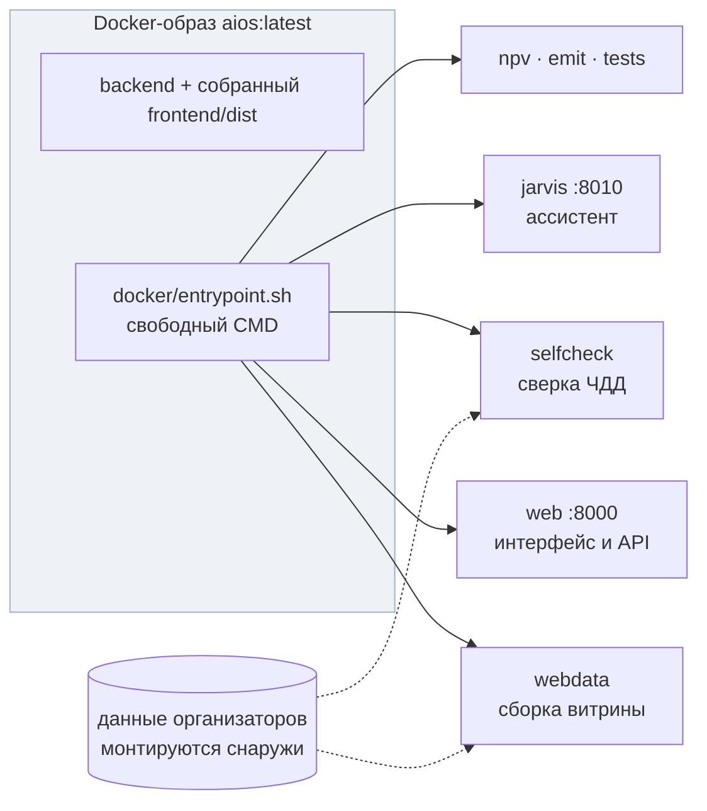

# Архитектура решения

Схемы снимались с кода, а не рисовались по замыслу. Имена модулей в блоках —
настоящие пути в репозитории.

## 1. Общая картина

Три слоя: точки входа, тринадцать ограниченных контекстов, общее ядро.
Зависимости идут только сверху вниз.

Правило слоёв внутри контекста: `domain` не знает ни про `application`,
ни про `infrastructure`. Сторож — `tests/architecture/backend/test_context_boundaries.py`,
списки исключений пусты.

## 2. Сквозной прогон: управление → симулятор → ЧДД

Главный поток `aios run full`. Суть решения в том, что поиск идёт по суррогату,
а подтверждение — по настоящему гидродинамическому симулятору.

Почему так: полный прогон ГГДМ дорог по времени, суррогат — дёшев. Поиск
перебирает варианты на суррогате, но **ни один результат не принимается на веру**:
финалисты пересчитываются настоящим OPM, и если заявленный ЧДД не сошёлся
с расчётным, прогон отклоняется.

## 3. Четыре гейта отбора

Кандидат проходит их по очереди; каждый умеет отклонить.

`ood_threshold` — защита от главного риска суррогата: модель уверенно
ошибается за пределами обучающей выборки. Кандидат, непохожий на то, что
модель видела, до OPM не доходит.

## 4. Иерархия агентов политики

Решение принимается не одним агентом, а по уровням — от месторождения к скважине.

Реестр агентов — `policy/domain/agents/registry.py`. Каждое решение попадает
в след (`policy/domain/trace.py`), поэтому инженер может увидеть, **почему**
агент выбрал именно этот режим.

## 5. Объяснимость: Джарвис

Отдельный контекст, который отвечает на вопросы по системе и показывает,
что происходило в прогоне.

RAG собран на чистой стандартной библиотеке — без внешних зависимостей.
Индексируются документы репозитория и соседнего репозитория документации.

## 6. Развёртывание

Данные организаторов в образ не входят — монтируются томом. Поэтому образ
собирается и запускается на чистой машине, а расчёт требует смонтированных
данных.
